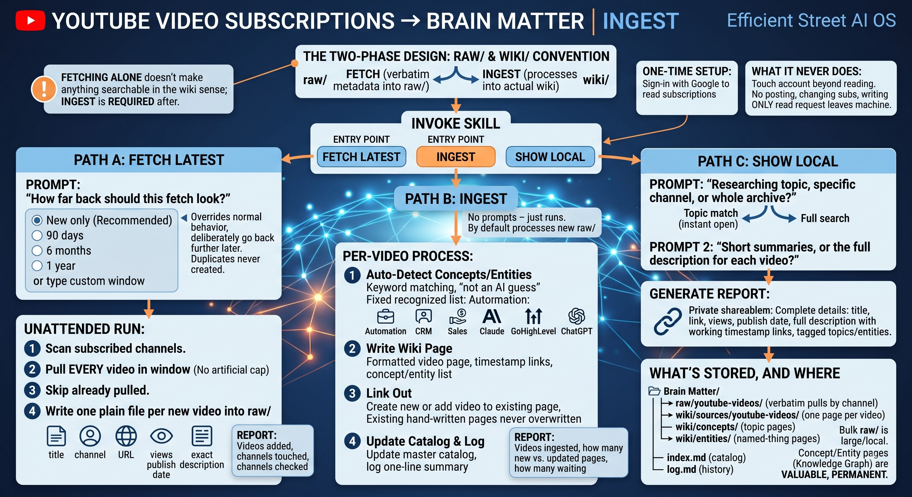

# YouTube Subscriptions → Second-Brain Ingest
# By Jeffrey Smith - efficientstreet.com

Pulls video metadata from your real YouTube subscriptions and turns it into a genuine, cross-linked knowledge graph in your Obsidian-style second brain — not just a flat list of videos.

Every video becomes its own note, with a full description, clickable links to any timestamps mentioned ("2:15 — the pricing breakdown" jumps straight to that moment), and real `[[wikilinks]]` to the topics and named tools/products it touches. Ask about a topic later and it opens instantly, showing you every video that's ever mentioned it — no re-searching, no re-watching.

**Read [GUIDE.md](GUIDE.md) for a full walkthrough of exactly what this does and how it behaves, prompt by prompt.**



---

## What you get

- **`fetch`** — pulls verbatim video metadata (title, description, views, publish date) from every channel you're subscribed to, into a local `raw/` folder. No interpretation, just the facts.
- **`ingest`** — processes `raw/` into your actual vault: one real note per video, plus auto-created/updated "concept" pages (topics like *Automation*, *CRM*, *Sales*) and "entity" pages (named things like *Claude*, *GoHighLevel*) that every relevant video links back to.
- **No artificial caps** — a channel that posted 500 videos in your chosen window gets all 500, not an arbitrary top-10.
- **Safe to re-run anytime** — both phases dedupe by YouTube's own Video ID, so running `fetch`/`ingest` again never creates duplicates.
- **Portable** — not hardcoded to any one project or vault. First run asks where you want the raw files and the wiki output to go.

## Requirements

- Python 3.9+
- A YouTube/Google account (the one whose subscriptions you want to pull)
- Your own Google Cloud OAuth credentials (free, ~5 minutes to set up — see below)
- (Optional but recommended) An Obsidian vault, or willingness to let this scaffold a minimal one

## Install

```bash
git clone https://github.com/SomewhereSimulated/youtube-subscriptions-ingest.git
cd youtube-subscriptions-ingest
pip install -r requirements.txt
```

## Set up your own Google OAuth credentials

**This project ships with zero credentials of any kind.** Every user needs their own — it takes about 5 minutes and costs nothing.

1. Go to [console.cloud.google.com](https://console.cloud.google.com) and create (or select) a project.
2. **APIs & Services → Library** → search **"YouTube Data API v3"** → **Enable**.
3. **APIs & Services → Credentials** → **+ Create Credentials** → **OAuth client ID**.
   - If prompted, configure the OAuth consent screen first (choose "External," fill in the required fields — this is fine for personal use, you don't need to publish/verify the app).
   - Application type: **Desktop app**. Name it anything.
   - Click **Create** — a popup shows your **Client ID** and **Client Secret**. Copy both (or find them again anytime under Credentials).
4. In this project folder:
   ```bash
   cp .env.example .env
   ```
   Paste your Client ID and Client Secret into `.env`.

## Configure and authenticate

```bash
# One-time: tell it where to put things
python scripts/youtube_subscriptions.py configure --raw-dir "./raw" --wiki-root "./my-vault"

# One-time: sign in with your Google account
python scripts/youtube_subscriptions.py auth

# Confirm it worked
python scripts/youtube_subscriptions.py test
```

`configure` is safe to run against an existing Obsidian vault — it only creates `index.md`/`log.md` if they don't already exist, and never overwrites real content. Point `--wiki-root` at your actual vault if you have one.

## Use it

```bash
# Pull new videos from your subscriptions (add --days N to backfill further, e.g. --days 90)
python scripts/youtube_subscriptions.py fetch

# Process what's been pulled into real wiki pages
python scripts/youtube_subscriptions.py ingest
```

That's it for the basics. `fetch` alone doesn't make anything searchable — `ingest` is the step that builds the actual knowledge graph.

## Using this with an AI coding assistant (Claude Code, etc.)

`SKILL.md` in this repo is a full behavioral spec — copy it into your assistant's skills folder (for Claude Code: `.claude/skills/subscription-videos-metadata/SKILL.md`) and it'll drive the whole workflow conversationally: asking how far back to fetch, walking you through first-time setup, generating full reports on request, and so on, instead of you typing raw commands.

## Tuning it to your own subscriptions

The topic/entity detection (`CONCEPT_TAXONOMY` and `ENTITY_TAXONOMY` near the top of `scripts/youtube_subscriptions.py`) is a plain keyword match — deterministic, free, and fast enough to run on a full archive, but it's tuned to one particular mix of AI/automation/business channels. If your subscriptions are about something else entirely (cooking, gaming, history — anything), extend or replace these dictionaries with keywords relevant to what you actually watch.

## License

MIT — see [LICENSE](LICENSE).

## Credits

**Jeffrey Smith**
Email: jeffrey@efficientstreet.com
YouTube: https://youtube.com/@JeffreyEntrepreneur
Website: https://efficientstreet.com

**Thanks:** I would like to thank Nate Herk and KJ Rainey for their wonderful classroom videos to help me jump into the world of AI automation and skill building. I would also like to thank their respective Skool communities for their feedback, support and answering my questions.

Special thanks to Ryan Cunningham for providing the code that powers the transcript-fetch phase, including cache-first logic, retry behavior with backoff, and graceful handling of unavailable captions.

Hopefully, this is the first file of many to come to my GitHub.
